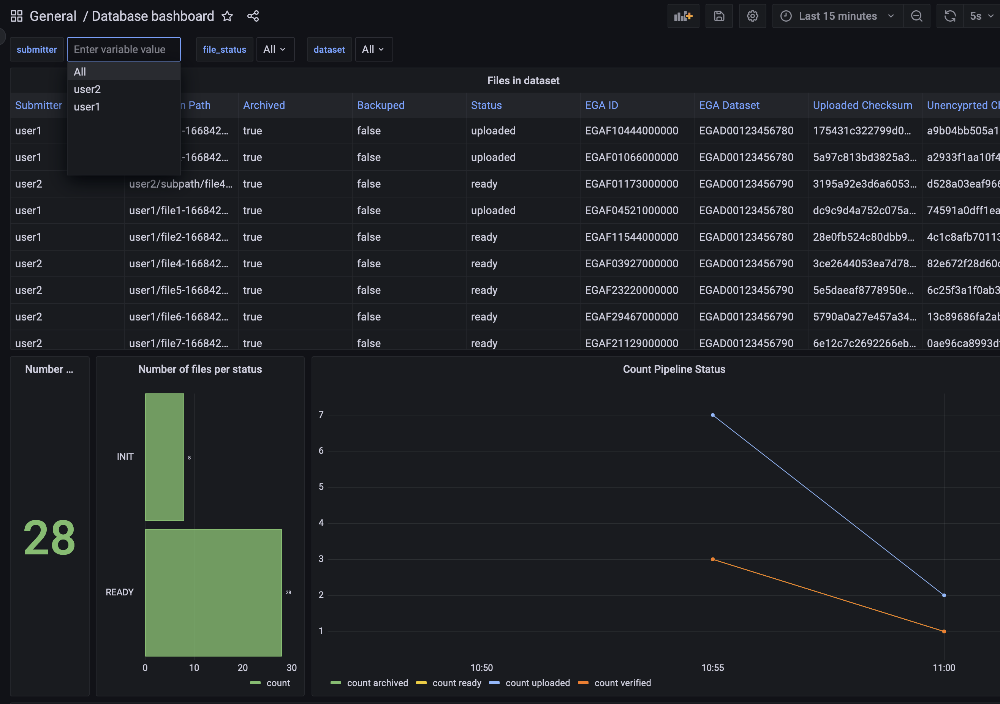
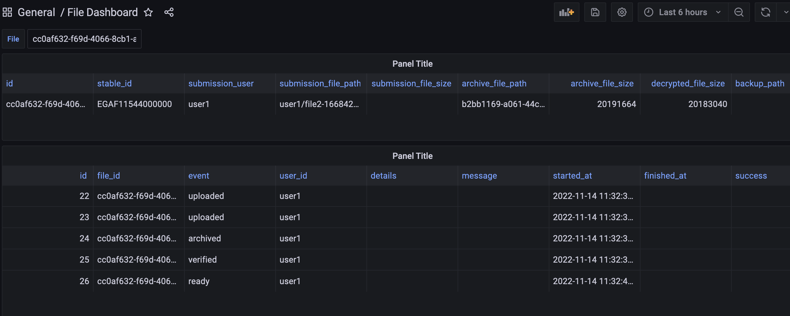

<!--

The paper.md, bibtex and figure file can be found in this repo:

  https://github.com/journal-of-research-objects/Example-BioHackrXiv-Paper

To modify, please clone the repo. You can generate PDF of the paper by
pasting above link (or yours) in

  http://biohackrxiv.genenetwork.org/

-->

# Introduction

Human genome and phenome data is classified as special categories data under the EU
GDPR legislation ([Art. 9 GDPR](https://gdpr-info.eu/art-9-gdpr/)). This requires special care to be taken when processing and
re-using this data for research. To enable this in a compliant way, a
federated approach was applied to the existing European Genome-phenome Archive ([EGA(https://ega-archive.org/)]) [@EGA],
creating the Federated EGA ([FEGA(https://ega-archive.github.io/FEGA-onboarding/#what-is-federated-ega)]) [@FEGA] in 2022. 
The Nordic countries, Norway, Finland and Sweden, together with Spain
and Germany, represent the first federated partners.

In the Nordics we have collaborated around our own implementation for our
federated EGA nodes. We have done this under the umbrella of the Nordic
e-Infrastructure Collaboration (NeIC)[https://neic.no/] [@NEIC], where we have had
three projects over the last 7 years: [Tryggve1](https://neic.no/tryggve1/)
[@Tryggve1], [Tryggve2](https://neic.no/tryggve2/) [@Tryggve2] and now
[Heilsa](https://neic.no/heilsa) [@Heilsa].

As we in the Nordics now move into production, there is a need for both System
Administrators and Helpdesk staff to be able to control and interrogate the system.
We need to both answer questions related to operations and identify errors in order to
better manage the services and infrastructure. To standardize this workflow and
make the system easier to use, we decided to build a Minimal Viable Product (MVP) for such an “Operator
Dashboard” during the ELIXIR Biohackathon 2022.

# Results

We used [grafana](https://grafana.com) to create an MVP
of a dashboard to easily diagnose the current state of the system and enable a few simple
interaction points with it. The processed data in this MVP was fabricated exclusively for demoeing.

There are two main views into the system:
* The first one is an overview over all
files and what state they are in: whether they have been moved from the inbox;
if they have been backed up; and if they have gotten the EGA identifiers from
[Central EGA](https://ega-archive.org), see Figure \ref{fig1}. It is possible
from this view to also click on a file to go to the second view.
* The second view contains
information about all events that has happened to that specific file, to aid
the helpdesk staff in the task of supporting the submitting researcher, see
Figure \ref{fig2}.

We also made a proof-of-concept of controlling the system through the
dashboard. For example, it is possible to click on a "Retry" link, which will trigger the state of a
file to change from its current value to "Uploaded" instead. We did not
have enough time to make the triggered action also restart the ingestion pipeline, as it should in a finalized interactive dashboard.

# Future Work

The dashboard needs to be integrated into the production system so we can try
it out with actual data. The interaction with the system is in a pre-alpha
demonstrator state, and will have to be removed before deploying to production.
There is also the open question on how to preload the dashboards,
currently done through the docker-compose, which may
make editing the dashboards overcomplicated.

We also aim to test this dashboard on our own internal helpdesk staff to see
whether our assumptions about what they want to see meets their needs.

We acknowledge the advantage for the development team working with the code-base
and deployments. This way, they were able to easily see what was going on in the system, and so
extending this approach with a few more developer focused views will probably be a good
idea.

## Acknowledgements

We thank the organisers of the BioHackathon-Europe 2022 for a well planned event.

## References

- Freeberg, M. A., Fromont, L. A., D’Altri, T., Romero, A. F., Ciges, J. I., Jene, A., ... & Rambla, J. (2022). The european Genome-phenome archive in 2021. Nucleic Acids Research, 50(D1), D980-D987.
